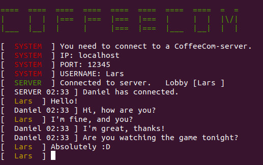

# CoffeeCom - Direct Communication

**ABOUT:**

The purpose of this application is to provide a tool for straight forward and easy communication - locally or globally. Create your own communication-lobby and access it from wherever you may be.

This application only works inside a terminal, no GUI (application-window) is provided.

**This project is still in it's ALPHA-phase.**

**IMAGES:**

**REQUIRED:**

CoffeeCom requires `Java` to run. At the moment you also need to compile the sources yourself, so you need the [Java JDK](https://www.oracle.com/java/technologies/jdk8-downloads.html) (development kit).

**INSTALLATION:**

1.  Compile the sources
    1. Navigate to the folder 'java' (@ coffeecom/src/main/java)
    2. From the command-line, compile the sources using `javac solarplus/coffeecom/File.java` (or use wildcard, e.g.: javac solarplus/../*)
2.  Run the server on the desired machine. Do this by running `java solarplus/coffeecom/Server` in the terminal.
3.  Run the client(s) on the desired machine(s). Do this by running `java solarplus/coffeecom/Client` in the terminal.
4.  If desired, port forwarding is a method for accessing server from anywhere. Read below if this applies to your server.

**ACCESS FROM ANYWHERE (PORT FORWARDING):**

1.  Create and assign a static IP to the machine running the CoffeeCom-server. (`Server.class`)
2.  Open the desired port from within the router (check if there is any regulation/restriction/standard existing for that port)
3.  Access the Coffeecom-server from anywhere using the static ip and port forwarded

**DISCLAIMER:**

*  I am not responsible for any misuse or violation you may do or act through/using this software.

*  I am not responsible for any loss of data, damage or value to you or anyone else.

*  This is an application solely intended for communication between individuals - use it with logic, common sense and good intentions.

USE THIS SOFTWARE AT YOUR OWN RISK.

**THANKS TO:** ❤

* [Jansi](https://github.com/fusesource/jansi) for enabling CoffeeCom to utilize colors and formatting in console.

`@author` solarplus
